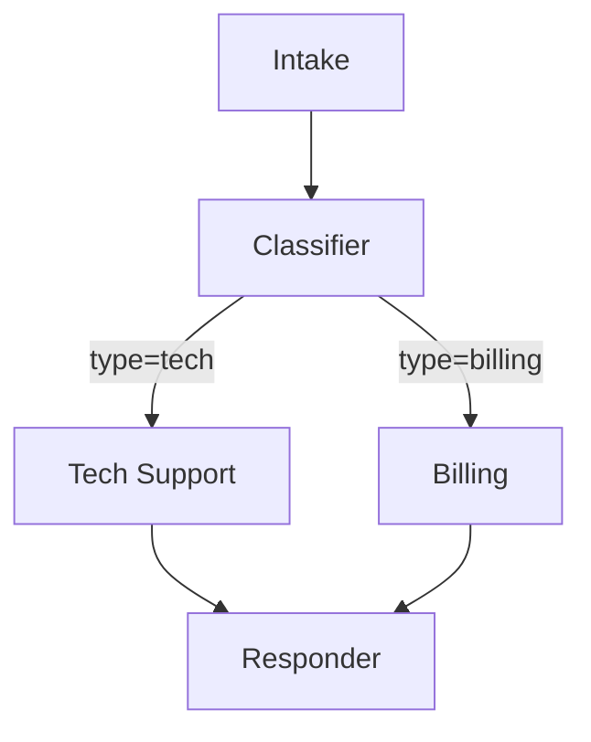

# Workflow Orchestration Implementation Plan

**Feature:** Advanced Workflow Patterns (Branching, Graph, Parallel)
**Target Versions:** v0.6.0 - v0.8.0
**Total Estimated Effort:** 10-15 hours
**Status:** Planning Phase
**Created:** 2025-10-29

---

## Executive Summary

This plan outlines the implementation of three advanced workflow orchestration patterns for Pagent: **Workflow** (branching logic), **Graph** (full DAG), and **Parallel** (concurrent execution). These features build upon the existing Chain and Pipeline patterns implemented in v0.5.1.

**Current State:**

- ✅ Chain - Simple sequential execution
- ✅ Pipeline - Named steps with transforms
- ✅ WorkflowResult/StepResult - Shared infrastructure
- ✅ 229 tests passing, 99%+ pass rate

**Target State:**

- Workflow with conditional branching
- Graph-based DAG with cycle detection
- Parallel execution with sequential fallback
- Comprehensive test coverage
- Production-ready examples

---

## Table of Contents

1. [Phase 1: Workflow (Branching Logic)](#phase-1-workflow-branching-logic)
2. [Phase 2: Graph (Full DAG)](#phase-2-graph-full-dag)
3. [Phase 3: Parallel Execution](#phase-3-parallel-execution)
4. [Testing Strategy](#testing-strategy)
5. [Integration & Documentation](#integration--documentation)
6. [Timeline & Milestones](#timeline--milestones)
7. [Success Criteria](#success-criteria)

---

## Phase 1: Workflow (Branching Logic)

**Version:** v0.6.0
**Estimated Effort:** 3-4 hours
**Priority:** HIGH

### Overview

The Workflow pattern extends Pipeline with conditional routing, allowing different execution paths based on agent output. This enables customer support triage, classification systems, and decision trees.

### API Design

```php
use Pagent\Workflow\Workflow;

// Basic branching
$result = Workflow::create()
    ->start(agent('intake'))
    ->then(agent('classifier'))
    ->branch(fn($result) => match(json_decode($result->content)->type) {
        'tech' => agent('tech-support'),
        'billing' => agent('billing'),
        'general' => agent('general'),
    })
    ->run('Customer inquiry');

// Multiple branches with merge
$result = Workflow::create()
    ->start(agent('intake'))
    ->then(agent('classifier'))
    ->branch(fn($r) => /* ... */)
    ->merge(agent('summarizer'))  // Merge results from all branches
    ->run($input);

// Conditional execution
$result = Workflow::create()
    ->start(agent('validator'))
    ->branchIf(
        condition: fn($r) => json_decode($r->content)->valid,
        then: agent('processor'),
        else: agent('error-handler')
    )
    ->run($data);
```

### Implementation Plan

#### 1.1 Core Workflow Class

**File:** `src/Workflow/Workflow.php`

**Features:**

- Fluent API with `start()`, `then()`, `branch()`, `branchIf()`, `merge()`
- Support for callable branch selectors
- Result merging from multiple branches
- Error handling per branch
- Reuse WorkflowResult infrastructure

**Key Methods:**

```php
class Workflow
{
    public static function create(): self;
    public function start(Agent|Provider $agent): self;
    public function then(Agent|Provider $agent): self;
    public function branch(callable $selector): self;
    public function branchIf(callable $condition, Agent|Provider $then, Agent|Provider $else): self;
    public function merge(?Agent $merger = null): self;
    public function run(mixed $input): WorkflowResult;
}
```

**Implementation Steps:**

1. Create `Workflow` class with fluent builder pattern (1 hour)
2. Implement `branch()` with callable selector (1 hour)
3. Add `branchIf()` shorthand for binary conditions (30 min)
4. Implement `merge()` for combining branch results (1 hour)
5. Handle edge cases (empty branches, invalid selector returns) (30 min)

#### 1.2 Branch Result Handling

**Challenges:**

- Storing results from multiple branches
- Passing context to merge agent
- Tracking which branch was taken

**Solution:**

```php
// WorkflowResult already supports multiple steps
// Add branch metadata to StepResult

class StepResult {
    public readonly ?string $branch;  // NEW: Which branch produced this
}

// In WorkflowResult, track branch paths
public function branches(): array; // NEW: Get all branch names taken
public function branchResult(string $name): ?StepResult; // NEW: Get result from specific branch
```

#### 1.3 Error Handling

```php
Workflow::create()
    ->start(agent('intake'))
    ->branch(fn($r) => match($r->type) {
        'tech' => agent('tech-support'),
        'billing' => agent('billing'),
    })
    ->onBranchError(function($exception, $branchName, $input) {
        // Handle branch-specific errors
        return agent('fallback')->prompt($input);
    })
    ->run($input);
```

### Testing Requirements

**File:** `tests/Unit/Workflow/WorkflowTest.php`

1. Basic branching with match expression
2. Multiple branch paths
3. Branch merging with aggregator agent
4. `branchIf()` for binary conditions
5. Error handling in branches
6. Invalid selector returns (non-Agent)
7. Empty branch results
8. Access branch-specific results
9. Nested workflows (branch contains workflow)
10. Performance with many branches

**Estimated:** 15-20 test cases

### Example Implementation

**File:** `examples/10-workflow-branching.php`

```php
<?php
// Customer support triage workflow

$intake = mock([
    'My internet is down' => 'Customer reports internet connectivity issue',
]);

$classifier = mock([
    'Customer reports internet connectivity issue' => '{"type": "tech", "urgency": "high", "summary": "Internet down"}',
]);

$techSupport = mock([
    '{"type": "tech", "urgency": "high", "summary": "Internet down"}' => 'Technical resolution: Check router, reboot modem...',
]);

$billing = mock([
    '...' => 'Billing resolution: ...',
]);

$result = Workflow::create()
    ->start($intake)
    ->then($classifier)
    ->branch(fn($r) => match(json_decode($r->content)->type) {
        'tech' => $techSupport,
        'billing' => $billing,
    })
    ->run('My internet is down');

echo "Branch taken: {$result->branches()[0]}\n";
echo "Resolution: {$result->final}\n";
```

### Documentation Requirements

**File:** `docs/workflow-branching.md`

- Branching vs. Pipeline comparison
- When to use branching
- Branch selector patterns (match, if/else, complex logic)
- Merging branch results
- Error recovery strategies
- Real-world examples:
  - Customer support routing
  - Content moderation (approve/reject/review)
  - Multi-step validation with fallbacks

---

## Phase 2: Graph (Full DAG)

**Version:** v0.7.0
**Estimated Effort:** 5-6 hours
**Priority:** MEDIUM

### Overview

The Graph pattern provides maximum flexibility with node-based workflow definition, edge connections with conditions, cycle detection, and visualization capabilities. This enables complex workflows like state machines, dependency graphs, and parallel-convergent patterns.

### API Design

```php
use Pagent\Workflow\Graph;

$workflow = Graph::create()
    // Define nodes
    ->node('start', agent('intake'))
    ->node('classify', agent('classifier'))
    ->node('tech', agent('tech-support'))
    ->node('billing', agent('billing'))
    ->node('escalate', agent('escalation'))
    ->node('respond', agent('responder'))

    // Define edges with conditions
    ->edge('start', 'classify')
    ->edge('classify', 'tech', when: fn($r) => $r->type === 'tech')
    ->edge('classify', 'billing', when: fn($r) => $r->type === 'billing')
    ->edge('tech', 'respond')
    ->edge('billing', 'respond')
    ->edge('tech', 'escalate', when: fn($r) => $r->escalate === true)
    ->edge('escalate', 'respond')

    // Execute from start node
    ->run('start', 'Customer inquiry');

// Visualize as Mermaid diagram
echo $workflow->toMermaid();

// Export graph structure
$structure = $workflow->export();
```

### Implementation Plan

#### 2.1 Core Graph Classes

**Files:**

- `src/Workflow/Graph.php` - Main graph builder
- `src/Workflow/GraphNode.php` - Node representation
- `src/Workflow/GraphEdge.php` - Edge with conditions
- `src/Workflow/GraphExecutor.php` - Execution engine

**Graph.php:**

```php
class Graph
{
    protected array $nodes = [];  // name => GraphNode
    protected array $edges = [];  // from => [GraphEdge]

    public static function create(): self;
    public function node(string $name, Agent|Provider $agent): self;
    public function edge(string $from, string $to, ?callable $when = null): self;
    public function run(string $startNode, mixed $input): WorkflowResult;
    public function validate(): bool;  // Check for cycles, unreachable nodes
    public function toMermaid(): string;  // Generate Mermaid diagram
    public function export(): array;  // Export structure
}
```

**GraphNode.php:**

```php
readonly class GraphNode
{
    public function __construct(
        public string $name,
        public Agent|Provider $agent,
        public array $metadata = []
    ) {}
}
```

**GraphEdge.php:**

```php
readonly class GraphEdge
{
    public function __construct(
        public string $from,
        public string $to,
        public ?callable $condition = null,  // null = always traverse
        public array $metadata = []
    ) {}

    public function shouldTraverse(mixed $result): bool;
}
```

**GraphExecutor.php:**

```php
class GraphExecutor
{
    public function execute(
        Graph $graph,
        string $startNode,
        mixed $input
    ): WorkflowResult;

    protected function traverse(GraphNode $node, mixed $input): mixed;
    protected function selectNextNodes(GraphNode $current, mixed $result): array;
}
```

#### 2.2 Cycle Detection

**Algorithm:** Depth-First Search (DFS) with visited tracking

```php
class Graph
{
    public function detectCycles(): ?array
    {
        $visited = [];
        $recursionStack = [];

        foreach (array_keys($this->nodes) as $node) {
            if ($this->hasCycleDFS($node, $visited, $recursionStack)) {
                return $recursionStack;  // Return cycle path
            }
        }

        return null;  // No cycles
    }

    protected function hasCycleDFS(
        string $node,
        array &$visited,
        array &$recursionStack
    ): bool {
        // DFS implementation
    }
}
```

**Validation:**

```php
$graph = Graph::create()
    ->node('A', $agent1)
    ->node('B', $agent2)
    ->edge('A', 'B')
    ->edge('B', 'A');  // Cycle!

if ($cycles = $graph->detectCycles()) {
    throw new RuntimeException("Cycle detected: " . implode(' -> ', $cycles));
}
```

#### 2.3 Visualization

**Mermaid Diagram Generation:**

```php
class Graph
{
    public function toMermaid(): string
    {
        $lines = ['graph TD'];

        // Add nodes
        foreach ($this->nodes as $name => $node) {
            $lines[] = "    {$name}[\"{$node->agent->name}\"]";
        }

        // Add edges
        foreach ($this->edges as $from => $edges) {
            foreach ($edges as $edge) {
                $label = $edge->condition ? '|conditional|' : '';
                $lines[] = "    {$from} -->{$label} {$edge->to}";
            }
        }

        return implode("\n", $lines);
    }
}
```

**Output Example:**



#### 2.4 Advanced Execution

**Parallel Branch Execution:**

When multiple edges from a node can be traversed, execute all in parallel (or sequentially).

```php
class GraphExecutor
{
    protected bool $parallelBranches = false;

    public function enableParallelBranches(): self
    {
        $this->parallelBranches = true;
        return $this;
    }

    protected function selectNextNodes(GraphNode $current, mixed $result): array
    {
        $nextNodes = [];

        foreach ($this->graph->edges[$current->name] ?? [] as $edge) {
            if ($edge->shouldTraverse($result)) {
                $nextNodes[] = $edge->to;
            }
        }

        return $nextNodes;
    }
}
```

### Testing Requirements

**File:** `tests/Unit/Workflow/GraphTest.php`

1. Basic graph creation and node registration
2. Edge creation with and without conditions
3. Linear graph execution (A → B → C)
4. Branching graph (A → B, A → C)
5. Converging graph (A → C, B → C)
6. Diamond pattern (A → B/C → D)
7. Cycle detection (A → B → A)
8. Unreachable node detection
9. Conditional edge traversal
10. Multiple paths from single node
11. Mermaid diagram generation
12. Graph export/import
13. Invalid start node error
14. Missing node reference error
15. Complex multi-level graph

**Estimated:** 20-25 test cases

### Example Implementation

**File:** `examples/11-graph-workflow.php`

```php
<?php
// Complex approval workflow with escalation paths

$intake = mock([...]);
$riskAssessment = mock([...]);
$autoApprove = mock([...]);
$manualReview = mock([...]);
$escalate = mock([...]);
$finalDecision = mock([...]);

$workflow = Graph::create()
    ->node('intake', $intake)
    ->node('assess', $riskAssessment)
    ->node('auto_approve', $autoApprove)
    ->node('manual_review', $manualReview)
    ->node('escalate', $escalate)
    ->node('finalize', $finalDecision)

    ->edge('intake', 'assess')
    ->edge('assess', 'auto_approve', when: fn($r) => $r->risk === 'low')
    ->edge('assess', 'manual_review', when: fn($r) => $r->risk === 'medium')
    ->edge('assess', 'escalate', when: fn($r) => $r->risk === 'high')
    ->edge('auto_approve', 'finalize')
    ->edge('manual_review', 'finalize')
    ->edge('escalate', 'finalize');

// Validate before running
if ($cycles = $workflow->detectCycles()) {
    die("Graph has cycles: " . implode(' -> ', $cycles));
}

$result = $workflow->run('intake', $request);

// Visualize the workflow
echo "Workflow Diagram:\n";
echo $workflow->toMermaid();

// Show execution path
echo "\n\nExecution Path:\n";
foreach ($result->steps as $step) {
    echo "→ {$step->name} ({$step->agent})\n";
}
```

### Documentation Requirements

**File:** `docs/graph-workflows.md`

- Graph vs. Workflow vs. Pipeline comparison
- When to use graph-based workflows
- Building complex DAGs
- Cycle detection and prevention
- Visualization with Mermaid
- Real-world examples:
  - Approval workflows with escalation
  - Content moderation pipelines
  - Multi-stage data processing
  - State machines

---

## Phase 3: Parallel Execution

**Version:** v0.7.0
**Estimated Effort:** 2-3 hours
**Priority:** MEDIUM

### Overview

Parallel execution allows running multiple agents concurrently. Due to PHP's limitations (no native async), this implements a sequential fallback with optional extensions (pcntl, amphp, ReactPHP) for true parallelism.

### API Design

```php
use Pagent\Workflow\Parallel;

// Simple parallel execution
$results = Parallel::run([
    'facts' => fn() => agent('fact-extractor')->prompt($text),
    'sentiment' => fn() => agent('sentiment-analyzer')->prompt($text),
    'entities' => fn() => agent('entity-extractor')->prompt($text),
]);

// Results: ['facts' => ..., 'sentiment' => ..., 'entities' => ...]

// With merger agent
$summary = Parallel::run([
    'web' => fn() => agent('web-searcher')->prompt($query),
    'db' => fn() => agent('db-query')->prompt($query),
    'api' => fn() => agent('api-caller')->prompt($query),
])->merge(agent('summarizer'));

// Using workflow syntax
$result = Pipeline::create()
    ->parallel([
        'translate' => agent('translator'),
        'summarize' => agent('summarizer'),
        'analyze' => agent('analyzer'),
    ])
    ->merge(agent('combiner'))
    ->run($input);
```

### Implementation Plan

#### 3.1 Parallel Execution Strategies

**Strategy 1: Sequential (Default)**

Always available, no dependencies.

```php
class Parallel
{
    public static function run(array $tasks): ParallelResult
    {
        $results = [];

        foreach ($tasks as $name => $task) {
            $results[$name] = $task();
        }

        return new ParallelResult($results);
    }
}
```

**Strategy 2: Multi-Process (pcntl)**

Available on Unix systems with pcntl extension.

```php
class Parallel
{
    public static function runAsync(array $tasks): ParallelResult
    {
        if (!extension_loaded('pcntl')) {
            return self::run($tasks);  // Fallback
        }

        $processes = [];
        $pipes = [];

        foreach ($tasks as $name => $task) {
            $pipe = stream_socket_pair(STREAM_PF_UNIX, STREAM_SOCK_STREAM, STREAM_IPPROTO_IP);
            $pid = pcntl_fork();

            if ($pid === 0) {
                // Child process
                $result = $task();
                fwrite($pipe[1], serialize($result));
                exit(0);
            } else {
                // Parent process
                $processes[$name] = ['pid' => $pid, 'pipe' => $pipe[0]];
            }
        }

        // Collect results
        $results = [];
        foreach ($processes as $name => $process) {
            pcntl_waitpid($process['pid'], $status);
            $results[$name] = unserialize(stream_get_contents($process['pipe']));
        }

        return new ParallelResult($results);
    }
}
```

**Strategy 3: Async (amphp/ReactPHP)**

Optional dependency for true async.

```php
use Amp\Promise;
use function Amp\ParallelFunctions\parallelMap;

class Parallel
{
    public static function runWithAmphp(array $tasks): ParallelResult
    {
        if (!class_exists('Amp\Promise')) {
            return self::run($tasks);  // Fallback
        }

        $promises = [];
        foreach ($tasks as $name => $task) {
            $promises[$name] = Amp\call($task);
        }

        $results = Amp\Promise\wait(Amp\Promise\all($promises));
        return new ParallelResult($results);
    }
}
```

#### 3.2 ParallelResult Class

```php
class ParallelResult
{
    public function __construct(
        public readonly array $results
    ) {}

    public function get(string $name): mixed
    {
        return $this->results[$name] ?? null;
    }

    public function merge(Agent $merger): mixed
    {
        $combined = json_encode($this->results);
        return $merger->prompt("Combine these results: {$combined}")->content;
    }

    public function toArray(): array
    {
        return $this->results;
    }
}
```

#### 3.3 Integration with Pipeline

```php
class Pipeline
{
    public function parallel(array $agents): self
    {
        $this->steps[] = [
            'name' => 'parallel_' . uniqid(),
            'handler' => fn($input) => Parallel::run(
                array_map(fn($agent) => fn() => $agent->prompt($input), $agents)
            ),
            'type' => 'parallel',
        ];

        return $this;
    }
}
```

#### 3.4 Error Handling

```php
class Parallel
{
    public static function run(array $tasks, ?callable $onError = null): ParallelResult
    {
        $results = [];
        $errors = [];

        foreach ($tasks as $name => $task) {
            try {
                $results[$name] = $task();
            } catch (\Exception $e) {
                if ($onError) {
                    $results[$name] = $onError($e, $name);
                } else {
                    $errors[$name] = $e;
                }
            }
        }

        if (!empty($errors)) {
            throw new ParallelExecutionException($errors);
        }

        return new ParallelResult($results);
    }
}
```

### Testing Requirements

**File:** `tests/Unit/Workflow/ParallelTest.php`

1. Sequential execution (default)
2. Multiple parallel tasks
3. Result collection by name
4. Merge results with combiner agent
5. Error handling in one task
6. Error handling in multiple tasks
7. Custom error handler
8. Empty task array
9. Single task (no parallelism needed)
10. Large number of tasks (performance)
11. Integration with Pipeline
12. Integration with Workflow

**Estimated:** 12-15 test cases

**Optional (if pcntl available):**

**File:** `tests/Integration/ParallelExecutionTest.php`

1. Multi-process execution with pcntl
2. Process isolation (no shared state)
3. Process cleanup on error
4. Large data serialization between processes

**Estimated:** 5-8 test cases

### Example Implementation

**File:** `examples/12-parallel-execution.php`

```php
<?php
// Parallel data extraction from different sources

$webSearcher = mock([...]);
$dbQuerier = mock([...]);
$apiCaller = mock([...]);
$summarizer = mock([...]);

// Execute all in parallel (sequentially by default)
$results = Parallel::run([
    'web' => fn() => $webSearcher->prompt('Search web for: AI agents'),
    'db' => fn() => $dbQuerier->prompt('Query database for: AI agents'),
    'api' => fn() => $apiCaller->prompt('Call API for: AI agents'),
]);

echo "Web Results: {$results->get('web')}\n";
echo "DB Results: {$results->get('db')}\n";
echo "API Results: {$results->get('api')}\n\n";

// Merge results with summarizer
$summary = $results->merge($summarizer);
echo "Combined Summary: {$summary}\n\n";

// Using Pipeline syntax
$pipelineResult = Pipeline::create()
    ->step('extract', agent('extractor'))
    ->parallel([
        'translate' => agent('translator'),
        'summarize' => agent('summarizer'),
        'analyze' => agent('analyzer'),
    ])
    ->step('finalize', agent('finalizer'))
    ->run($input);
```

### Documentation Requirements

**File:** `docs/parallel-execution.md`

- Parallel vs. sequential execution
- PHP limitations and workarounds
- When to use parallel execution
- Performance considerations
- Extension requirements (pcntl, amphp)
- Error handling strategies
- Real-world examples:
  - Multi-source data aggregation
  - Parallel translation and summarization
  - Concurrent API calls
  - Batch processing

---

## Testing Strategy

### Unit Tests

**Coverage Goal:** 90%+ line coverage for workflow classes

**Test Organization:**

```
tests/Unit/Workflow/
├── WorkflowTest.php      (15-20 tests)
├── GraphTest.php         (20-25 tests)
├── GraphNodeTest.php     (5-8 tests)
├── GraphEdgeTest.php     (5-8 tests)
├── GraphExecutorTest.php (10-12 tests)
├── ParallelTest.php      (12-15 tests)
└── ParallelResultTest.php (5-8 tests)
```

**Total Estimated:** 70-95 unit tests

### Integration Tests

**Test Real-World Scenarios:**

```
tests/Integration/Workflow/
├── ComplexWorkflowTest.php    (Customer support triage)
├── GraphExecutionTest.php     (Approval workflows)
├── ParallelIntegrationTest.php (Multi-source aggregation)
└── MixedPatternsTest.php      (Chain + Workflow + Parallel)
```

**Total Estimated:** 15-20 integration tests

### Test Utilities

**Mock Helpers:**

```php
// tests/Helpers/WorkflowTestCase.php

class WorkflowTestCase
{
    protected function mockAgent(string $name, array $responses): Agent
    {
        return mock($responses)->withName($name);
    }

    protected function assertBranchTaken(WorkflowResult $result, string $branch): void
    {
        expect($result->branches())->toContain($branch);
    }

    protected function assertGraphHasNode(Graph $graph, string $node): void
    {
        expect($graph->hasNode($node))->toBeTrue();
    }
}
```

### Performance Tests

**Benchmarks:**

```php
// tests/Performance/WorkflowBenchmark.php

it('executes 100-node graph efficiently', function() {
    $graph = Graph::create();

    for ($i = 0; $i < 100; $i++) {
        $graph->node("node_{$i}", mock(["input" => "output_{$i}"]));
        if ($i > 0) {
            $graph->edge("node_" . ($i - 1), "node_{$i}");
        }
    }

    $start = microtime(true);
    $result = $graph->run('node_0', 'input');
    $duration = microtime(true) - $start;

    expect($duration)->toBeLessThan(2.0);  // < 2 seconds
    expect($result->meta->stepsExecuted)->toBe(100);
})->group('performance');
```

---

## Integration & Documentation

### Code Integration

**Files to Create:**

```
src/Workflow/
├── Workflow.php           (NEW - Phase 1)
├── Graph.php              (NEW - Phase 2)
├── GraphNode.php          (NEW - Phase 2)
├── GraphEdge.php          (NEW - Phase 2)
├── GraphExecutor.php      (NEW - Phase 2)
├── Parallel.php           (NEW - Phase 3)
├── ParallelResult.php     (NEW - Phase 3)
└── Exceptions/
    ├── CycleDetectedException.php
    ├── InvalidNodeException.php
    └── ParallelExecutionException.php
```

**Existing Files to Update:**

```
src/Workflow/
├── Pipeline.php           (ADD parallel() method)
└── WorkflowResult.php     (ADD branches(), branchResult() methods)
```

### Helper Functions

**File:** `src/functions.php` (append)

```php
function workflow(string $name = ''): Workflow
{
    return Workflow::create();
}

function graph(string $name = ''): Graph
{
    return Graph::create();
}

function parallel(array $tasks): ParallelResult
{
    return Parallel::run($tasks);
}
```

### Documentation

**New Documentation Files:**

```
docs/
├── workflow-branching.md      (Phase 1)
├── graph-workflows.md         (Phase 2)
├── parallel-execution.md      (Phase 3)
└── orchestration-patterns.md  (Overview of all patterns)
```

**Update Existing Documentation:**

```
docs/
├── README.md                  (Add links to new patterns)
└── orchestration-workflows.md (Update with new patterns)

guide/
├── 02-recipes-task-oriented.md (Add workflow examples)
├── 04-concepts-deep-dive.md    (Add orchestration concepts)
└── 05-api-reference.md         (Add new API references)
```

### Examples

**New Example Files:**

```
examples/
├── 10-workflow-branching.php     (Phase 1)
├── 11-graph-workflow.php         (Phase 2)
└── 12-parallel-execution.php     (Phase 3)
```

### Changelog

**Update:** `CHANGELOG.md`

```markdown
## [v0.6.0] - 2025-XX-XX

### Added

- Workflow pattern with branching logic
- Conditional routing with `branch()` and `branchIf()`
- Branch merging with combiner agents
- 15-20 new tests for workflow branching

## [v0.7.0] - 2025-XX-XX

### Added

- Graph-based DAG workflows
- Cycle detection algorithm
- Mermaid diagram visualization
- Parallel execution with sequential fallback
- Optional pcntl/amphp support for true parallelism
- 40-50 new tests for graph and parallel execution
```

---

## Timeline & Milestones

### Phase 1: Workflow (v0.6.0)

**Duration:** 3-4 hours
**Target:** 1 week after plan approval

**Breakdown:**

- Day 1: Core Workflow class (2 hours)
- Day 2: Testing + examples (1.5 hours)
- Day 3: Documentation + polish (30 min)

**Deliverables:**

- ✅ `src/Workflow/Workflow.php`
- ✅ `tests/Unit/Workflow/WorkflowTest.php` (15-20 tests)
- ✅ `examples/10-workflow-branching.php`
- ✅ `docs/workflow-branching.md`

### Phase 2: Graph (v0.7.0)

**Duration:** 5-6 hours
**Target:** 2 weeks after Phase 1

**Breakdown:**

- Day 1-2: Core graph classes (3 hours)
- Day 3: Cycle detection + validation (1.5 hours)
- Day 4: Visualization + testing (1 hour)
- Day 5: Examples + documentation (1 hour)

**Deliverables:**

- ✅ `src/Workflow/Graph.php`
- ✅ `src/Workflow/GraphNode.php`
- ✅ `src/Workflow/GraphEdge.php`
- ✅ `src/Workflow/GraphExecutor.php`
- ✅ `tests/Unit/Workflow/GraphTest.php` (20-25 tests)
- ✅ `examples/11-graph-workflow.php`
- ✅ `docs/graph-workflows.md`

### Phase 3: Parallel (v0.7.0)

**Duration:** 2-3 hours
**Target:** 1 week after Phase 2

**Breakdown:**

- Day 1: Sequential implementation (1 hour)
- Day 2: Testing + integration (1 hour)
- Day 3: Examples + documentation (1 hour)

**Deliverables:**

- ✅ `src/Workflow/Parallel.php`
- ✅ `src/Workflow/ParallelResult.php`
- ✅ `tests/Unit/Workflow/ParallelTest.php` (12-15 tests)
- ✅ `examples/12-parallel-execution.php`
- ✅ `docs/parallel-execution.md`

### Total Timeline

**Estimated:** 3-4 weeks (10-15 hours of development)
**Buffer:** +20% for unexpected issues (12-18 hours total)

---

## Success Criteria

### Functional Requirements

**Phase 1 (Workflow):**

- ✅ Branching with callable selectors
- ✅ `branchIf()` for binary conditions
- ✅ Branch merging with combiner agents
- ✅ Error handling per branch
- ✅ 15-20 tests passing
- ✅ Working example with customer support triage

**Phase 2 (Graph):**

- ✅ Node and edge registration
- ✅ Conditional edge traversal
- ✅ Cycle detection algorithm
- ✅ Mermaid diagram generation
- ✅ Graph validation (cycles, unreachable nodes)
- ✅ 20-25 tests passing
- ✅ Working example with approval workflow

**Phase 3 (Parallel):**

- ✅ Sequential execution (always available)
- ✅ Result collection by name
- ✅ Merge results with combiner agent
- ✅ Error handling per task
- ✅ Optional pcntl support (documented)
- ✅ 12-15 tests passing
- ✅ Working example with multi-source aggregation

### Quality Requirements

- ✅ PHPStan level 9 compliance (0 errors)
- ✅ Code coverage: 90%+ for new classes
- ✅ All tests passing (100% pass rate)
- ✅ Examples run without errors
- ✅ Documentation complete and clear

### Integration Requirements

- ✅ Works with existing Chain and Pipeline
- ✅ Uses shared WorkflowResult infrastructure
- ✅ Compatible with all providers (Anthropic, OpenAI, Mock)
- ✅ Follows existing code style (Pint, PER)
- ✅ Helper functions in `functions.php`

### Performance Requirements

- ✅ 100-node graph executes in < 2 seconds (sequential)
- ✅ Memory usage: < 10MB per 100 steps
- ✅ No memory leaks in long-running workflows

---

## Risk Mitigation

### Technical Risks

**Risk 1: Cycle detection performance**

- **Impact:** High
- **Likelihood:** Low
- **Mitigation:** Use efficient DFS algorithm, memoize results, limit graph size

**Risk 2: PHP async limitations**

- **Impact:** Medium
- **Likelihood:** High
- **Mitigation:** Document clearly, provide sequential fallback, optional extensions

**Risk 3: Complex branching logic errors**

- **Impact:** High
- **Likelihood:** Medium
- **Mitigation:** Comprehensive testing, clear error messages, examples

### Resource Risks

**Risk 1: Development time overrun**

- **Impact:** Medium
- **Likelihood:** Medium
- **Mitigation:** Phased approach, buffer time, MVP first

**Risk 2: Testing complexity**

- **Impact:** Medium
- **Likelihood:** Medium
- **Mitigation:** Test utilities, mock helpers, clear test structure

### Adoption Risks

**Risk 1: Too complex API**

- **Impact:** High
- **Likelihood:** Low
- **Mitigation:** Simple examples first, gradual complexity, good documentation

**Risk 2: Unclear when to use each pattern**

- **Impact:** Medium
- **Likelihood:** Medium
- **Mitigation:** Comparison guide, decision tree, real-world examples

---

## Future Enhancements (Post-v0.8.0)

### Workflow Visualization

**Generate HTML/SVG diagrams:**

```php
$workflow->visualize('workflow.html');
$graph->exportSvg('graph.svg');
```

### Workflow State Persistence

**Save/restore workflow state:**

```php
$workflow = Graph::create()->load('workflow.json');
$state = $workflow->saveState();
$workflow->restoreState($state);
```

### Workflow Debugging

**Step-through debugging:**

```php
$workflow->debug()
    ->breakpoint('classify')
    ->onStep(fn($step) => var_dump($step))
    ->run($input);
```

### Workflow Templates

**Reusable workflow patterns:**

```php
$template = WorkflowTemplate::customerSupport();
$workflow = $template->customize([
    'tech-agent' => agent('tech-support'),
    'billing-agent' => agent('billing'),
]);
```

---

## Conclusion

This implementation plan provides a phased approach to adding advanced workflow orchestration to Pagent. By building on the existing Chain and Pipeline patterns, we can deliver powerful branching logic, graph-based DAGs, and parallel execution while maintaining code quality and test coverage.

The plan prioritizes:

1. **Simplicity** - Start with Workflow branching (most common use case)
2. **Flexibility** - Add Graph for complex patterns
3. **Performance** - Provide Parallel execution with fallbacks
4. **Quality** - Comprehensive testing and documentation
5. **Integration** - Works seamlessly with existing patterns

**Next Steps:**

1. Review and approve this plan
2. Begin Phase 1 implementation (Workflow)
3. Iterate based on feedback
4. Release v0.6.0 with Workflow branching
5. Continue with Phases 2 and 3 for v0.7.0

---

**Author:** Claude Code + Helge Sverre  
**Date:** 2025-10-29  
**Version:** 1.0  
**Status:** Ready for Review
