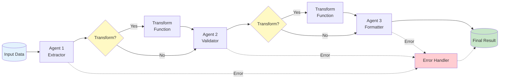
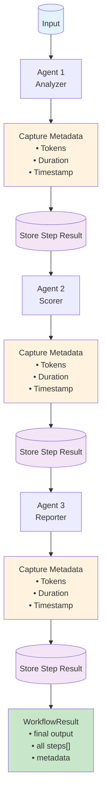
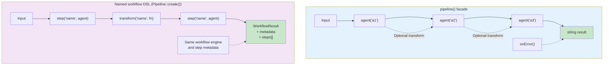
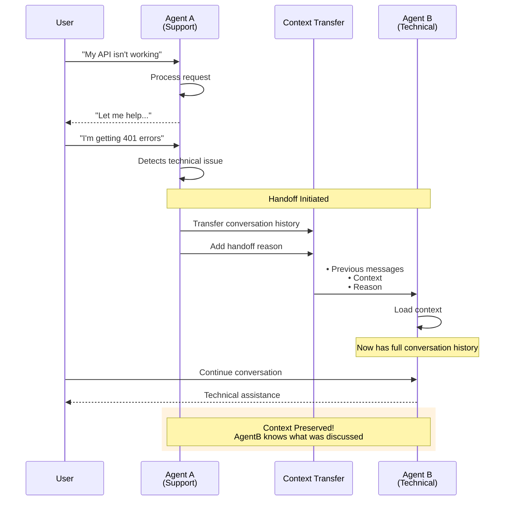
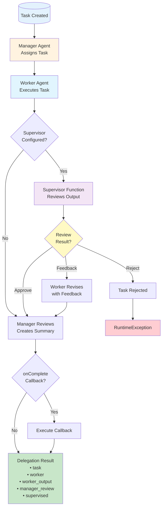
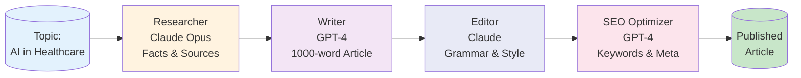
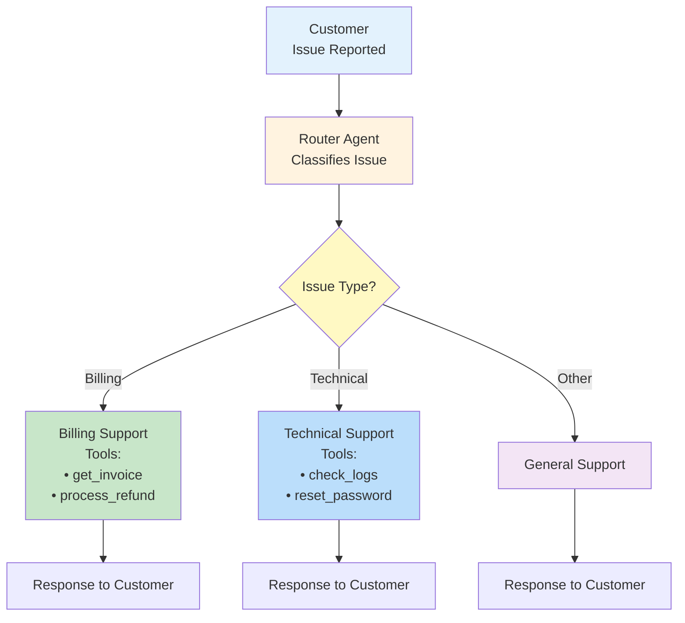
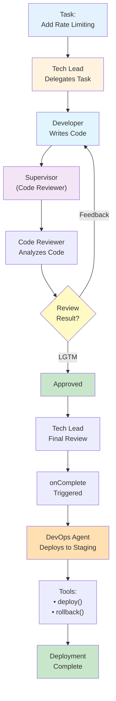

# Agent Orchestration & Workflows

This guide explains Pagent's orchestration features for multi-agent systems. It
covers chains, delegation, conversation transfers, and composed workflows.

## Overview

Pagent provides four main orchestration patterns. `Chain`, `Workflow\Pipeline`,
and the `pipeline()` compatibility facade all execute through the same workflow
engine, so step metadata, token accounting, telemetry, and failure handling have
one implementation.

1. **Pipeline** - Sequential agent execution with transforms and error handling
2. **Chain** - Simple sequential agent execution
3. **Handoff** - Transfer conversations between specialized agents
4. **Delegation** - Manager-worker pattern with optional supervision

### Orchestration Patterns Overview

```mermaid
graph TB
    subgraph Pipeline["Pipeline"]
        P1[Agent 1] --> P2[Agent 2] --> P3[Agent 3]
        P1 -.->|"Output becomes input"| P2
        P2 -.->|"Output becomes input"| P3
    end

    subgraph Chain["Chain"]
        C1[Agent 1] --> C2[Agent 2] --> C3[Agent 3]
        C1 -.->|"+ Metadata"| C2
        C2 -.->|"+ Metadata"| C3
    end

    subgraph Handoff["Handoff"]
        H1[Agent A] -->|"Transfer conversation"| H2[Agent B]
        H1 -.->|"Context + History"| H2
    end

    subgraph Delegation["Delegation"]
        D1[Manager] -->|"Assigns task"| D2[Worker]
        D2 -->|"Returns work"| D3[Supervisor]
        D3 -->|"Approves/Rejects"| D1
    end

    style Pipeline fill:#e3f2fd
    style Chain fill:#f3e5f5
    style Handoff fill:#fff3e0
    style Delegation fill:#e8f5e9
```



---

## Table of Contents

- [Pipeline Workflows](#pipeline-workflows)
- [Chain Workflows](#chain-workflows)
  - [Named Workflow Pipeline](#workflow-pipeline-advanced)
- [Agent Handoffs](#agent-handoffs)
- [Task Delegation](#task-delegation)
- [Real-World Use Cases](#real-world-use-cases)
- [Advanced Patterns](#advanced-patterns)
- [Best Practices](#best-practices)

---

## Pipeline Workflows

Pipelines enable sequential agent execution where the output of one agent becomes the input to the next. Perfect for multi-stage processing tasks.

> **API choice:** Use `pipeline()` when you prefer named registered agents and its
> string-result/error-handler facade. Use `Pagent\Workflow\Pipeline` for named
> steps and transforms, or `Chain` for anonymous sequential steps. They share the
> same execution engine; the difference is DSL and result shape, not semantics.

### Pipeline Flow Diagram



### Basic Pipeline

```php
use function agent;
use function pipeline;

// Define agents
agent('extractor')
    ->provider('openai')
    ->system('Extract key information from text. Output JSON.');

agent('validator')
    ->provider('openai')
    ->system('Validate and correct data. Output JSON.');

agent('formatter')
    ->provider('openai')
    ->system('Format data for presentation.');

// Create pipeline
$result = pipeline('data-processor')
    ->agent('extractor')
    ->agent('validator')
    ->agent('formatter')
    ->run('John Doe, age 30, lives in Oslo. Email: john@example.com');

echo $result; // Formatted output from the final agent
```

### Pipeline with Transforms

Add custom transformations between agent steps:

```php
$result = pipeline('content-pipeline')
    ->agent('blog-writer')
    ->agent('seo-optimizer', function ($content) {
        // Transform before sending to next agent
        return "Optimize this content for SEO:\n\n{$content}";
    })
    ->agent('social-media', function ($optimized) {
        // Extract key points for social media
        return "Create a tweet from this: {$optimized}";
    })
    ->run('Write about PHP 8.3 features');

echo $result; // Final tweet text
```

### Pipeline with Error Handling

Handle failures gracefully:

```php
$result = pipeline('safe-pipeline')
    ->agent('step1')
    ->agent('step2')
    ->agent('step3')
    ->onError(function ($error, $stage, $agentName) {
        error_log("Pipeline failed at stage {$stage} ({$agentName}): {$error->getMessage()}");
        return "Pipeline failed gracefully. Please try again.";
    })
    ->run($input);
```

### Accessing Pipeline Results

Get detailed information about each step:

```php
$pipeline = pipeline('analysis')
    ->agent('analyzer')
    ->agent('summarizer');

$result = $pipeline->run($data);

// Access individual stage results
$results = $pipeline->getResults();

foreach ($results as $stage) {
    echo "Stage {$stage['stage']}: {$stage['agent']}\n";
    echo "Input: {$stage['input']}\n";
    echo "Output: {$stage['output']}\n";
    echo "Tokens: {$stage['response']->tokens}\n\n";
}
```

---

## Chain Workflows

Chains are the smallest workflow DSL. They automatically pass outputs between
agents and return a `WorkflowResult` with per-step metadata. They use the same
engine as named workflow pipelines and the `pipeline()` facade.

### Chain Flow Diagram



### Basic Chain

```php
use Pagent\Workflow\Chain;
use function agent;

// Create agents
$analyzer = agent('analyzer')
    ->provider('anthropic')
    ->model('claude-sonnet-4-6')
    ->system('Analyze the sentiment of text.');

$scorer = agent('scorer')
    ->provider('anthropic')
    ->system('Score sentiment from 1-10.');

// Build and run chain
$result = Chain::create()
    ->add($analyzer)
    ->add($scorer)
    ->run('This product is amazing!');

// Access final output
echo $result->final; // "Score: 9/10"

// Access metadata
echo "Total tokens: {$result->meta->totalTokens}\n";
echo "Duration: {$result->meta->duration}s\n";
echo "Steps: {$result->meta->stepsExecuted}\n";
```

### Chain with Detailed Results

```php
$result = Chain::create()
    ->add(agent('step1'))
    ->add(agent('step2'))
    ->add(agent('step3'))
    ->run($input);

// Access each step's result
foreach ($result->steps as $step) {
    echo "Step: {$step->name}\n";
    echo "Agent: {$step->agent}\n";
    echo "Output: {$step->output}\n";
    echo "Tokens used: {$step->meta->tokens}\n";
    echo "Duration: {$step->meta->duration}s\n\n";
}

// Export all results
$data = $result->toArray();
file_put_contents('workflow-results.json', json_encode($data, JSON_PRETTY_PRINT));
```

### Workflow Pipeline (Advanced)

For more control, use `Pagent\Workflow\Pipeline` with named steps and transforms:

```php
use Pagent\Workflow\Pipeline;
use function agent;

// Create agents
$extractor = agent('extractor')
    ->provider('anthropic')
    ->system('Extract structured data');

$validator = agent('validator')
    ->provider('openai')
    ->system('Validate the data');

// Build pipeline with named steps
$result = Pipeline::create()
    ->step('extract', $extractor)
    ->transform('normalize', function ($data) {
        // Custom transformation
        return strtolower(trim($data));
    })
    ->step('validate', $validator)
    ->run($input);

// Access specific steps by name
$extracted = $result->step('extract');
echo "Extracted: {$extracted->output}\n";
echo "Tokens: {$extracted->meta->tokens}\n";

$normalized = $result->step('normalize');
echo "Normalized: {$normalized->output}\n";

// Final result
echo "Final: {$result->final}\n";
```

#### Key Differences: Chain vs Pipeline (Workflow)

| Feature        | Chain                     | Pipeline (Workflow)           |
| -------------- | ------------------------- | ----------------------------- |
| Step naming    | Auto (`step_0`, `step_1`) | Named (`extract`, `validate`) |
| Transforms     | No                        | Yes (`->transform()`)         |
| Access by name | No                        | Yes (`->step('name')`)        |
| Complexity     | Simpler                   | More flexible                 |

#### DSL comparison



### Accessing Structured Data

If agents return JSON, easily access fields:

```php
agent('data-extractor')
    ->provider('anthropic')
    ->system('Extract data as JSON: {name, email, age}');

$result = Chain::create()
    ->add(agent('data-extractor'))
    ->run('Contact: John Doe, john@example.com, 30 years old');

// Access JSON fields directly
$name = $result->get('name'); // "John Doe"
$email = $result->get('email'); // "john@example.com"
$age = $result->get('age', 0); // 30, or 0 if not found
```

---

## Agent Handoffs

Handoffs allow you to transfer conversations from one agent to another, preserving context. Perfect for escalations and specialized handling.

### Handoff Flow Diagram



### Basic Handoff

```php
// Define agents
agent('support')
    ->provider('openai')
    ->system('General customer support. Escalate complex issues.');

agent('technical')
    ->provider('anthropic')
    ->system('Technical support specialist.');

// Start conversation
$support = agent('support');
$response = $support->prompt('My API integration is not working');

// Handoff to technical team
$technical = $support->handoff('technical', 'Customer needs API help');

// Continue conversation with new agent
$solution = $technical->prompt('I\'m getting a 401 error');
echo $solution->content;
```

### Handoff with Reason

The reason helps provide context to the receiving agent:

```php
$billing = agent('billing');
$billing->prompt('Customer wants refund for order #12345');

// Handoff to legal team with reason
$legal = $billing->handoff(
    'legal-team',
    'Refund request exceeds $500, needs legal approval'
);

$decision = $legal->prompt('What is our refund policy for this case?');
```

### Multi-Level Handoffs

```php
// Tier 1 support
$tier1 = agent('tier1-support');
$tier1->prompt('Customer issue: Cannot access account');

// Escalate to tier 2
$tier2 = $tier1->handoff('tier2-support', 'Account access issue');
$tier2->prompt('I\'ve checked and the account seems locked');

// Escalate to engineering
$engineering = $tier2->handoff('engineering', 'Account locked, needs investigation');
$fix = $engineering->prompt('Can you unlock the account?');
```

---

## Task Delegation

Delegation implements a manager-worker pattern where a manager agent delegates tasks to worker agents and reviews their output.

### Delegation Flow Diagram



### Basic Delegation

```php
agent('project-manager')
    ->provider('anthropic')
    ->system('You are a project manager who reviews work.');

agent('developer')
    ->provider('anthropic')
    ->system('You are a senior PHP developer.');

$manager = agent('project-manager');

$result = $manager->delegate('Create a function to validate email addresses')
    ->to('developer')
    ->execute();

echo "Task: {$result->task}\n";
echo "Worker: {$result->worker}\n";
echo "Output: {$result->worker_output}\n";
echo "Manager Review: {$result->manager_review}\n";
```

### Delegation with Supervision

Add a supervisor function to validate worker output:

```php
$result = $manager->delegate('Write a secure password hashing function')
    ->to('developer')
    ->supervise(function ($output, $task) {
        // Validate the output
        if (!str_contains($output, 'password_hash')) {
            return 'Please use PHP\'s password_hash() function for security';
        }

        if (!str_contains($output, 'PASSWORD_BCRYPT')) {
            return 'Use PASSWORD_BCRYPT algorithm';
        }

        return true; // Approved
    })
    ->execute();
```

### Delegation with Callbacks

Execute code when delegation completes:

```php
$result = $manager->delegate('Generate API documentation')
    ->to('technical-writer')
    ->supervise(function ($output, $task) {
        // Check documentation quality
        $wordCount = str_word_count($output);

        if ($wordCount < 100) {
            return 'Documentation too brief. Add more details and examples.';
        }

        return true;
    })
    ->onComplete(function ($result) {
        // Save to file
        file_put_contents('docs/api.md', $result->worker_output);

        // Log completion
        error_log("Documentation generated by {$result->worker}");

        // Send notification
        mail('team@example.com', 'API docs ready', $result->manager_review);
    })
    ->execute();
```

### Chaining Delegations

For complex multi-stage tasks, chain multiple delegations:

```php
// Stage 1: Backend development
$backendResult = $manager->delegate('Build authentication API endpoints')
    ->to('backend-developer')
    ->execute();

// Stage 2: Frontend development (using backend output)
$frontendResult = $manager->delegate("Build UI for: {$backendResult->worker_output}")
    ->to('frontend-developer')
    ->execute();

// Stage 3: Security review (using both outputs)
$securityResult = $manager->delegate(
    "Review security:\n" .
    "Backend: {$backendResult->worker_output}\n" .
    "Frontend: {$frontendResult->worker_output}"
)
    ->to('security-expert')
    ->supervise(function ($output, $task) {
        // Final security check
        return str_contains($output, 'CSRF') && str_contains($output, 'XSS');
    })
    ->execute();
```

---

## Real-World Use Cases

### 1. Content Production Pipeline



```php
// Define content production agents
agent('researcher')
    ->provider('anthropic')
    ->model('claude-sonnet-4-6')
    ->system('Research topics thoroughly and provide key facts.');

agent('writer')
    ->provider('openai')
    ->model('gpt-4')
    ->system('Write engaging, well-structured articles.');

agent('editor')
    ->provider('anthropic')
    ->system('Edit for grammar, clarity, and style.');

agent('seo-optimizer')
    ->provider('openai')
    ->system('Optimize content for SEO with keywords and meta descriptions.');

// Content pipeline
$article = pipeline('content-production')
    ->agent('researcher')
    ->agent('writer', fn($research) => "Write a 1000-word article using this research:\n\n{$research}")
    ->agent('editor')
    ->agent('seo-optimizer')
    ->run('Topic: Benefits of AI in Healthcare');

// Save the final article
file_put_contents('article.md', $article);
```

### 2. Customer Support Routing



```php
agent('support-router')
    ->provider('openai')
    ->system('Route customer issues to appropriate departments. Identify issue type.');

agent('billing-support')
    ->provider('openai')
    ->system('Handle billing and payment inquiries.')
    ->tool('get_invoice', fn($id) => getInvoice($id))
    ->tool('process_refund', fn($id, $amount) => processRefund($id, $amount));

agent('technical-support')
    ->provider('anthropic')
    ->system('Solve technical issues and bugs.')
    ->tool('check_logs', fn($userId) => checkErrorLogs($userId))
    ->tool('reset_password', fn($email) => resetPassword($email));

// Route customer inquiry
$router = agent('support-router');
$classification = $router->prompt('Customer says: I was charged twice for my subscription');

// Handoff based on classification
if (str_contains($classification->content, 'billing')) {
    $specialist = $router->handoff('billing-support', 'Billing inquiry detected');
} else {
    $specialist = $router->handoff('technical-support', 'Technical issue detected');
}

$response = $specialist->prompt('How can I help resolve this?');
```

### 3. Code Review & Deployment



```php
agent('developer')
    ->provider('anthropic')
    ->system('Senior developer who writes clean, tested code.');

agent('code-reviewer')
    ->provider('anthropic')
    ->model('claude-sonnet-4-6')
    ->system('Review code for bugs, security issues, and best practices.');

agent('devops')
    ->provider('openai')
    ->system('Handle deployment and infrastructure.')
    ->tool('deploy', fn($env) => deploy($env))
    ->tool('rollback', fn($version) => rollback($version));

$manager = agent('tech-lead')
    ->provider('anthropic')
    ->system('Technical lead who oversees development.');

// Delegate development task
$result = $manager->delegate('Add rate limiting to API endpoints')
    ->to('developer')
    ->supervise(function ($code, $task) {
        // Code review
        $reviewer = agent('code-reviewer');
        $review = $reviewer->prompt("Review this code:\n\n{$code}");

        // Check for approval
        if (str_contains($review->content, 'LGTM') ||
            str_contains($review->content, 'looks good')) {
            return true;
        }

        // Return feedback
        return $review->content;
    })
    ->onComplete(function ($result) {
        // Deploy to staging
        $devops = agent('devops');
        $devops->prompt('Deploy the rate limiting code to staging environment');
    })
    ->execute();
```

### 4. Data Processing Pipeline

```php
agent('data-cleaner')
    ->provider('openai')
    ->system('Clean and normalize data. Remove duplicates and fix formatting.');

agent('data-validator')
    ->provider('anthropic')
    ->system('Validate data against rules. Flag any issues.');

agent('data-enricher')
    ->provider('openai')
    ->system('Enrich data with additional context and metadata.')
    ->tool('geocode', fn($address) => geocodeAddress($address))
    ->tool('lookup_company', fn($name) => lookupCompany($name));

agent('data-analyzer')
    ->provider('anthropic')
    ->model('claude-sonnet-4-6')
    ->system('Analyze data and generate insights.');

// Process customer data
$rawData = file_get_contents('customers.csv');

$result = Chain::create()
    ->add(agent('data-cleaner'))
    ->add(agent('data-validator'))
    ->add(agent('data-enricher'))
    ->add(agent('data-analyzer'))
    ->run($rawData);

// Save results with metadata
$output = [
    'processed_data' => $result->final,
    'metadata' => [
        'total_tokens' => $result->meta->totalTokens,
        'processing_time' => $result->meta->duration,
        'steps_executed' => $result->meta->stepsExecuted,
    ],
    'step_details' => array_map(fn($step) => [
        'name' => $step->name,
        'agent' => $step->agent,
        'tokens' => $step->meta->tokens,
        'duration' => $step->meta->duration,
    ], $result->steps),
];

file_put_contents('processed-data.json', json_encode($output, JSON_PRETTY_PRINT));
```

### 5. Legal Document Processing

```php
agent('document-parser')
    ->provider('anthropic')
    ->model('claude-sonnet-4-6')
    ->system('Extract key information from legal documents.');

agent('clause-analyzer')
    ->provider('anthropic')
    ->system('Analyze contract clauses for risks and obligations.');

agent('summarizer')
    ->provider('openai')
    ->model('gpt-4')
    ->system('Create executive summaries of legal documents.');

agent('legal-reviewer')
    ->provider('anthropic')
    ->model('claude-sonnet-4-6')
    ->system('Senior legal counsel who reviews contracts.');

// Process contract
$contract = file_get_contents('contract.pdf');

$result = pipeline('legal-review')
    ->agent('document-parser')
    ->agent('clause-analyzer')
    ->agent('summarizer')
    ->onError(function ($error, $stage, $agent) {
        error_log("Legal review failed at {$agent}: {$error->getMessage()}");

        // Notify legal team
        mail('legal@example.com', 'Contract review failed',
            "Failed at stage {$stage}. Manual review required.");

        return 'Error: Manual review required';
    })
    ->run($contract);

// Get final review from senior counsel
$counsel = agent('legal-reviewer');
$finalReview = $counsel->prompt("Review this contract analysis:\n\n{$result}");

// Send to stakeholders
sendContractReview($finalReview->content);
```

### 6. E-commerce Product Management

```php
agent('product-describer')
    ->provider('openai')
    ->model('gpt-4')
    ->system('Write compelling product descriptions highlighting benefits.');

agent('seo-specialist')
    ->provider('openai')
    ->system('Optimize product content for search engines.');

agent('translator')
    ->provider('anthropic')
    ->system('Translate content to multiple languages while maintaining tone.');

agent('qa-checker')
    ->provider('anthropic')
    ->system('Check content for accuracy and brand compliance.');

// Process new product
$productInfo = [
    'name' => 'Wireless Noise-Canceling Headphones',
    'features' => ['40h battery', 'ANC', 'Bluetooth 5.2', 'Foldable'],
    'price' => 299.99,
];

$manager = agent('content-manager')
    ->provider('anthropic')
    ->system('Content manager who oversees product content creation.');

// Delegate product description creation
$result = $manager->delegate(json_encode($productInfo))
    ->to('product-describer')
    ->to('seo-specialist')
    ->to('qa-checker')
    ->supervise(function ($output, $task) {
        // Check for required elements
        $required = ['features', 'benefits', 'specifications'];

        foreach ($required as $element) {
            if (!str_contains(strtolower($output), $element)) {
                return "Missing section: {$element}";
            }
        }

        return true;
    })
    ->onComplete(function ($result) use ($productInfo) {
        // Save English version
        saveProductDescription($productInfo['name'], $result->worker_output);

        // Translate to other languages
        $translator = agent('translator');
        foreach (['es', 'fr', 'de'] as $lang) {
            $translated = $translator->prompt(
                "Translate to {$lang}:\n\n{$result->worker_output}"
            );
            saveProductDescription($productInfo['name'], $translated->content, $lang);
        }
    })
    ->execute();
```

---

## Advanced Patterns

### Conditional Branching

Create workflows with conditional logic:

```php
function processCustomerInquiry(string $inquiry): string
{
    // Classify inquiry
    $classifier = agent('classifier')
        ->provider('openai')
        ->system('Classify inquiries as: billing, technical, sales, or general');

    $classification = $classifier->prompt($inquiry);
    $type = trim(strtolower($classification->content));

    // Route to appropriate pipeline
    return match($type) {
        'billing' => pipeline('billing-flow')
            ->agent('billing-support')
            ->agent('payment-specialist')
            ->run($inquiry),

        'technical' => pipeline('tech-flow')
            ->agent('tech-support')
            ->agent('engineering')
            ->run($inquiry),

        'sales' => pipeline('sales-flow')
            ->agent('sales-rep')
            ->agent('account-manager')
            ->run($inquiry),

        default => agent('general-support')->prompt($inquiry)->content,
    };
}
```

### Parallel Processing

Process multiple items concurrently:

```php
function processBatch(array $items): array
{
    $processor = agent('processor')
        ->provider('openai')
        ->system('Process and analyze items.');

    $results = [];

    // Process in parallel (pseudo-parallel in PHP)
    foreach ($items as $index => $item) {
        $results[$index] = $processor->prompt($item);
    }

    return $results;
}

// Or use actual parallel processing with processes/threads
function processParallel(array $items): array
{
    $promises = [];

    foreach ($items as $index => $item) {
        $promises[$index] = async(function () use ($item) {
            return agent('processor')->prompt($item);
        });
    }

    return array_map(fn($p) => $p->wait(), $promises);
}
```

### Retry with Fallback

Implement retry logic with fallback agents:

```php
function robustPipeline(string $input): string
{
    try {
        // Try primary pipeline with GPT-4
        return pipeline('primary')
            ->agent('gpt4-analyzer')
            ->agent('gpt4-processor')
            ->run($input);
    } catch (Exception $e) {
        error_log("Primary pipeline failed: {$e->getMessage()}");

        try {
            // Fallback to Claude
            return pipeline('fallback')
                ->agent('claude-analyzer')
                ->agent('claude-processor')
                ->run($input);
        } catch (Exception $e2) {
            error_log("Fallback pipeline failed: {$e2->getMessage()}");

            // Final fallback: simple agent
            return agent('basic-processor')->prompt($input)->content;
        }
    }
}
```

### Workflow State Management

Maintain state across complex workflows:

```php
class WorkflowState
{
    public array $data = [];
    public array $history = [];

    public function set(string $key, mixed $value): void
    {
        $this->data[$key] = $value;
        $this->history[] = ['action' => 'set', 'key' => $key, 'time' => time()];
    }

    public function get(string $key, mixed $default = null): mixed
    {
        return $this->data[$key] ?? $default;
    }
}

function statefulWorkflow(string $input): string
{
    $state = new WorkflowState();

    // Step 1: Extract data
    $extractor = agent('extractor');
    $extracted = $extractor->prompt($input);
    $state->set('extracted', $extracted->content);

    // Step 2: Validate
    $validator = agent('validator');
    $validated = $validator->prompt($state->get('extracted'));
    $state->set('validated', $validated->content);

    // Step 3: Transform
    $transformer = agent('transformer');
    $transformed = $transformer->prompt($state->get('validated'));
    $state->set('final', $transformed->content);

    // Save workflow history
    file_put_contents('workflow-state.json', json_encode([
        'data' => $state->data,
        'history' => $state->history,
    ], JSON_PRETTY_PRINT));

    return $state->get('final');
}
```

### Human-in-the-Loop

Add human approval to workflows:

```php
function humanReviewWorkflow(string $input): string
{
    // AI processes initial request
    $result = pipeline('content-creation')
        ->agent('writer')
        ->agent('editor')
        ->run($input);

    // Request human review
    echo "AI Generated Content:\n{$result}\n\n";
    echo "Approve? (yes/no): ";
    $approval = trim(fgets(STDIN));

    if ($approval !== 'yes') {
        // AI revises based on feedback
        echo "Feedback: ";
        $feedback = trim(fgets(STDIN));

        $reviser = agent('reviser')
            ->provider('anthropic')
            ->system('Revise content based on feedback.');

        $revised = $reviser->prompt(
            "Original: {$result}\n\nFeedback: {$feedback}\n\nRevise:"
        );

        return $revised->content;
    }

    return $result;
}
```

---

## Best Practices

### 1. Agent Specialization

Create focused agents for specific tasks:

```php
// Bad: Generic agent doing everything
agent('do-everything')
    ->system('Do any task the user asks');

// Good: Specialized agents
agent('data-extractor')
    ->system('Extract structured data from text. Output JSON only.');

agent('data-validator')
    ->system('Validate data formats and ranges. Flag issues.');

agent('data-formatter')
    ->system('Format data for presentation. Create readable output.');
```

### 2. Clear System Prompts

Be explicit about agent roles and output formats:

```php
// Bad: Vague system prompt
agent('analyzer')->system('Analyze stuff');

// Good: Clear expectations
agent('sentiment-analyzer')
    ->system(
        'You are a sentiment analyzer. ' .
        'Analyze text sentiment and respond with exactly one word: ' .
        'positive, negative, or neutral. ' .
        'Do not include explanations or additional text.'
    );
```

### 3. Error Handling

Always handle potential failures:

```php
// Good: Comprehensive error handling
try {
    $result = pipeline('processing')
        ->agent('step1')
        ->agent('step2')
        ->onError(function ($error, $stage, $agent) {
            // Log error
            error_log("Pipeline error at {$agent}: {$error->getMessage()}");

            // Notify team
            sendAlert("Workflow failed", $error->getMessage());

            // Return safe default
            return 'Error: Processing failed. Manual review required.';
        })
        ->run($input);
} catch (Exception $e) {
    // Fallback handling
    $result = 'System error. Please try again later.';
    error_log("Critical error: {$e->getMessage()}");
}
```

### 4. Token Optimization

Monitor and optimize token usage:

```php
// Track token usage
$result = Chain::create()
    ->add(agent('step1'))
    ->add(agent('step2'))
    ->add(agent('step3'))
    ->run($input);

// Check token consumption
if ($result->meta->totalTokens > 10000) {
    error_log("High token usage: {$result->meta->totalTokens} tokens");

    // Consider using cheaper models or optimizing prompts
}

// Log costs
$costPerToken = 0.00002; // Example rate
$cost = $result->meta->totalTokens * $costPerToken;
logCost('workflow-processing', $cost);
```

### 5. Testing Workflows

Test workflows with known inputs:

```php
function testWorkflow(): void
{
    $testCases = [
        ['input' => 'test 1', 'expected' => 'output 1'],
        ['input' => 'test 2', 'expected' => 'output 2'],
    ];

    foreach ($testCases as $test) {
        $result = pipeline('test-pipeline')
            ->agent('processor')
            ->run($test['input']);

        assert(
            str_contains($result, $test['expected']),
            "Test failed for input: {$test['input']}"
        );
    }

    echo "All workflow tests passed!\n";
}
```

### 6. Workflow Documentation

Document complex workflows:

```php
/**
 * Content Production Workflow
 *
 * This workflow creates publication-ready content through multiple stages:
 *
 * 1. Research: Gathers facts and sources
 * 2. Writing: Creates first draft
 * 3. Editing: Refines grammar and style
 * 4. SEO: Optimizes for search engines
 * 5. Legal Review: Checks compliance
 *
 * @param string $topic The content topic
 * @return string Publication-ready content
 * @throws RuntimeException If any stage fails
 */
function contentProductionWorkflow(string $topic): string
{
    return pipeline('content-production')
        ->agent('researcher')    // Stage 1
        ->agent('writer')        // Stage 2
        ->agent('editor')        // Stage 3
        ->agent('seo-optimizer') // Stage 4
        ->agent('legal-reviewer') // Stage 5
        ->run($topic);
}
```

### 7. Monitoring & Logging

Add comprehensive monitoring:

```php
function monitoredWorkflow(string $input): string
{
    $startTime = microtime(true);

    try {
        $result = pipeline('monitored')
            ->agent('step1')
            ->agent('step2')
            ->run($input);

        $duration = microtime(true) - $startTime;

        // Log success
        logMetric('workflow.success', 1);
        logMetric('workflow.duration', $duration);

        return $result;
    } catch (Exception $e) {
        $duration = microtime(true) - $startTime;

        // Log failure
        logMetric('workflow.failure', 1);
        logMetric('workflow.duration', $duration);
        logError('workflow.error', $e->getMessage());

        throw $e;
    }
}
```

---

## Performance Considerations

### Minimize Agent Calls

Combine steps when possible:

```php
// Inefficient: 3 separate agents for similar tasks
pipeline('inefficient')
    ->agent('extract-name')
    ->agent('extract-email')
    ->agent('extract-phone')
    ->run($text);

// Efficient: 1 agent extracts all data
agent('data-extractor')
    ->system('Extract name, email, and phone as JSON.')
    ->prompt($text);
```

### Cache Results

Cache expensive operations:

```php
function cachedPipeline(string $input): string
{
    $cacheKey = 'pipeline_' . md5($input);

    // Check cache
    if ($cached = cache()->get($cacheKey)) {
        return $cached;
    }

    // Run pipeline
    $result = pipeline('expensive')
        ->agent('research-agent')  // Expensive
        ->agent('analysis-agent')  // Expensive
        ->run($input);

    // Cache for 1 hour
    cache()->put($cacheKey, $result, 3600);

    return $result;
}
```

### Async Processing

Process long workflows asynchronously:

```php
// Queue workflow for background processing
dispatch(new ProcessWorkflowJob($input));

// Job handler
class ProcessWorkflowJob
{
    public function handle()
    {
        $result = pipeline('long-workflow')
            ->agent('step1')
            ->agent('step2')
            ->agent('step3')
            ->run($this->input);

        // Notify when complete
        sendNotification('Workflow complete', $result);
    }
}
```

---

## Summary

Pagent's orchestration features enable building sophisticated multi-agent systems:

- **Pipelines** - Sequential processing with transforms and error handling
- **Chains** - Simple sequential execution with detailed metadata
- **Handoffs** - Context-aware conversation transfers
- **Delegation** - Manager-worker patterns with supervision
- **Flexible** - Combine patterns for complex workflows
- **Observable** - Track tokens, duration, and step details
- **Robust** - Built-in error handling and recovery

Choose the smallest orchestration primitive that fits the task, and add explicit
error handling and observability before deploying a multi-agent workflow.
